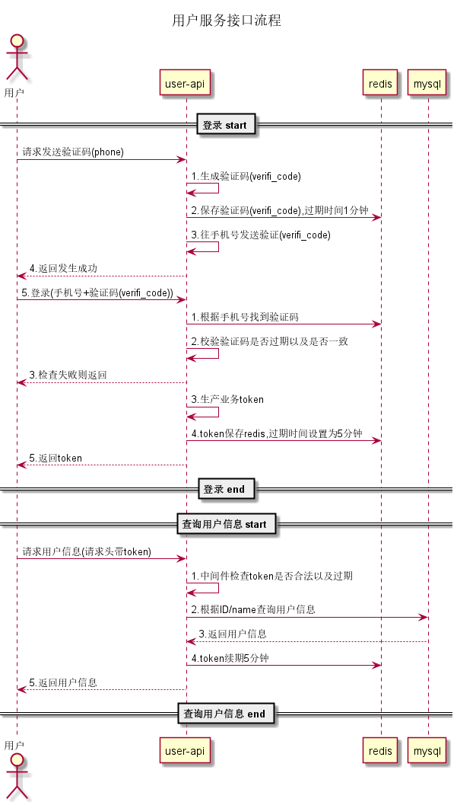

## user-api

用户服务

##  代码框架说明
微服务使用gin框架,代码目录基于三层架构,DB使用gorm库。

├─cmd   main函数目录
├─config  配置文件
├─doc     相关文档
│  └─apidocument  接口文档
└─internal      应用程序封装代码
    ├─config    配置解析
    ├─data      数据定义
    ├─db        数据库相关
    ├─dto       传输适配
    ├─imp          
    ├─middleware   中间件
    ├─model        数据表模型
    ├─repository   持久化层
    │  └─dao       
    ├─router       
    ├─service      service层
    └─util         工具相关

## 设计思路
（本方案限定为网关内的业务服务, 请求内容加解密签名动作可在网关考虑）

### 1.手机号+验证码登录系统, 获取业务请求的token

### 2.中间件进行校验token

### 3.业务请求

## 运行
通过配置文件(config/conf.yaml)配置端口8080, 接口数据通过打桩返回。

运行：
`
go run cmd/main.go --conf=./config/conf.yaml 
`

